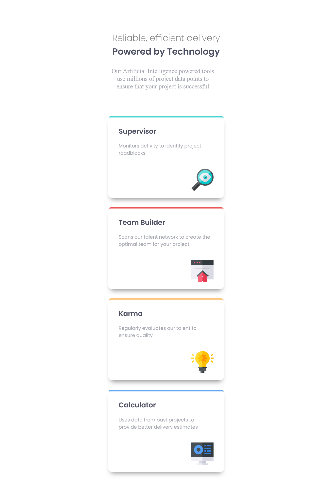
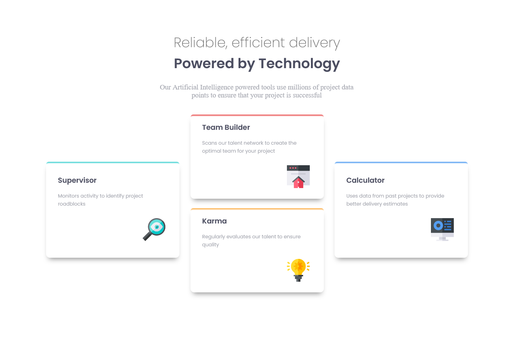

# Frontend Mentor - Four card feature section solution
## Table of contents

  - [The challenge](#the-challenge)
  - [Screenshot](#screenshot)
  - [Link](#link)
  - [Built with](#built-with)

### The challenge

Users should be able to:

- View the optimal layout for the site depending on their device's screen size

### Screenshot

### Link

- Solution URL: [My Solution](https://www.frontendmentor.io/solutions/four-card-feature-section-solution-by-htmlcss-E_xZhopU2k)

### Built with

- HTML
- CSS 
- Flexbox
- Mobile-first 

## Author

- Website - [Dr-Gringo](https://symphonious-fourcardfeature-by-gringo.netlify.app/)
- Frontend Mentor - [@DrGring](https://www.frontendmentor.io/profile/DrGring)
- Twitter - [@djahlin_e](https://www.twitter.com/djahlin_e)